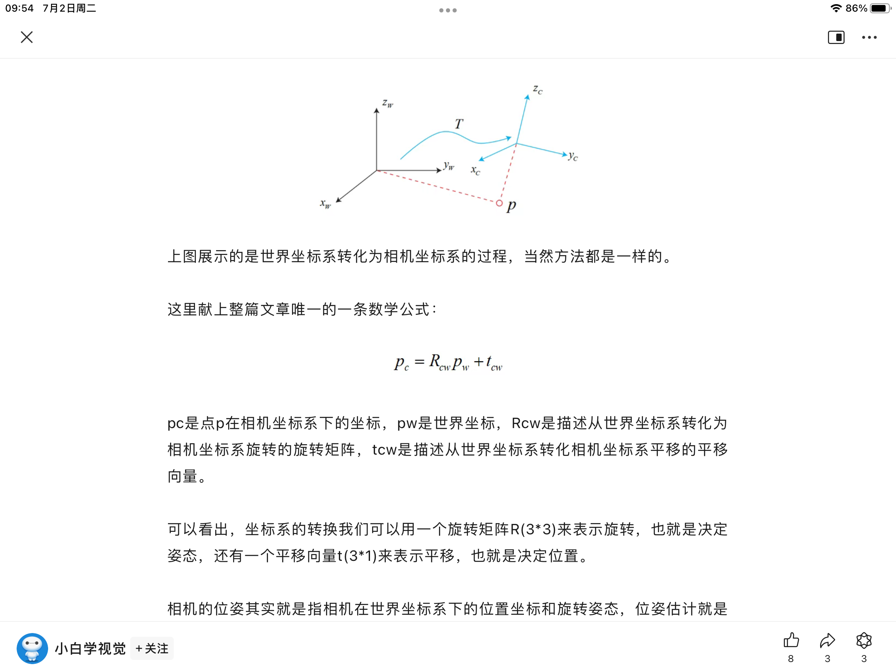
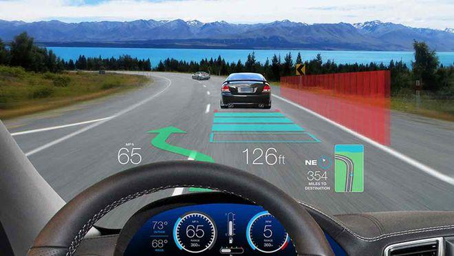

# 我的首页

大家好，欢迎来到我的博客空间

  
## 社会、政治、经济、历史、文化

### 土地兼并导致王朝覆灭
> 当农民无法活下去的时候，王朝离结束也就不远了

    朝廷的财政收入主要是靠土地税维持的，也就是农民种地，毕竟是农业大国。在王朝初期，可以收到很多税，
    一般王朝初期都是欣欣向荣，但是过了百八十年以后，也就是说经历了两三任皇帝以后，人口越来越多，官员
    越来越多，贵族数量越来越多，朝廷的财政收入和农民的收入开始入不敷出，
    在初期，贵族官员无需纳税，朝廷供养，此时人少，没有感觉，过了百八十年后，皇室贵族从个位数繁衍到数千名数万，他们还侵占了大部分土地，
    原本村里十户农民都有的耕地，现在只有两户了，剩下的八户农民没有地，只能给地主打工当佃户来交租，这个时候土地税就减少了，这两
    户耕地的农民除了骂骂街并没有什么办法。这个时候朝廷摊派的徭役就没有人去了，比如修水利，修河堤打水井这些基础设施
    没有人去干，朝廷拨下来的银子，因为河堤没修好，有的地方洪水泛滥，农民房子被毁，有的地方水井没人打，就干旱成灾，导致
    粮食产量大面积减少，有时候看起来是天灾 ，但是人祸的成分也不小。呢么朝廷要派人去赈灾，但是朝廷没有
    银子也没有粮食，可怎么办。在这种恶性循环下，王朝实力越来越弱，以前周边臣服的游牧民族趁你病要你命，朝廷要打仗，打仗要有军饷，不发工资谁
    替你卖命，想要筹备军饷就只能再问呢两户农民征收，但是重压之下这两户农民已经活不下去了，于是将黄色头巾绑在头上，皇帝看着亲王家里
    有两万亩田地，三个乡的农民都是他家的佃户，就连宦官家里都有一千亩田地和两家银行股份。如果皇帝处理好了，打土豪分田地，将他们的土地重新收回
    分给农民，此时回迎来王朝的中兴，降低了土地兼并的速度，但是朝廷里的势力盘根错节，互相帮助，他们联合起来的实力比皇帝还要大。明朝的崇祯就是面临
    这样的境地，所有臣子对他毕恭毕敬，但是心底里瞧不起的就是你崇祯帝，在座的各位都比你有钱，就算你这个王朝覆灭，换个王朝我也一样给皇帝打工
    古代封建王朝没有一个超过300年，历史反复上演，道理都懂，却没有一个王朝愿意去改变，
    

> 什么是[佃户](https://zhidao.baidu.com/question/991461279207700539/answer/4012922016.html)？和佃农的区别

  > 现代工业创造价值的速度快于土地兼并的速度
### 屁股决定脑袋
[车上和车下的人所在的位置不同，意味着立场不同](https://photo.baidu.com/photo/wap/albumShare/share/75997136071947416?from=linkShare)
车上的既得利益者总想保持自己的利益，这就是人性的自私，脑袋跟着屁股走，你的屁股坐在什么位置上，你的脑袋就会随之产生什么样的想法，原先没有的想法，现在都有了

## 视频
[小李](https://photo.baidu.com/photo/wap/albumShare/share/27143205929874584?from=linkShare)
[嘟嘟醉](https://h5.pipix.com/s/i6m3b8PB/)

## 图片

## Python

### openCV库

## SLAM
-slam的定义：自动驾驶/无人驾驶/无人机/机器人感知中，即时/同时/同步 定位与建图算法(slam)通过传感器收集到的实时数据，对车辆的位置和姿态进行估计和优化，构建高精度的点云地图。一边估测下一时刻的位姿，一边动态构建并更新全局一致性地图.SLAM（Simultaneous Localization and Mapping）算法是一种用于无人机或移动机器人同时定位自身位置和构建环境地图的算法。
[最详细的解释什么是slam](https://b23.tv/0KTcZWF)

传感器：双目相机，rgbd深度相机，结构光，激光雷达，毫米波雷达等都是常用的传感器，用来采集数据

分类：按照传感器的不同，分为视觉slam和激光雷达slam

用*相机*作为传感器的slam是视觉slam，但视觉传感器易受光线和天气变化的影响。而激光雷达可以准确获取三维数据且对环境变化不敏感

单一传感器获取的信息少，误差大，因此多传感器耦合，精度大

即使在多传感器耦合下，随着车辆位移的增加，在建图的过程中，帧与帧之间的匹配也会积累位姿误差，最终导致地图出现漂移，

回环检测可以检测当前传感器数据和历史传感器数据之间是否构成回环，然后构建回环帧之间的约束关系，从而有效地降低相邻帧之间匹配所造成的累计误差

在静止状态下，激光雷达发出的激光是旋转一周形成一个完整闭合的圆。但车辆是不断运动的，车载雷达旋转一周需要时间，会导致雷达开始扫描的起点和终点不在一条直线上，会产生一定程度的不完整漂移，这就是点云畸变，

惯性测量单元主要测量载体的角旋转速度和加速度，通过积分运算得到载体的位姿状态

### 三维空间中的刚体运动

### 李群和李代数

### 相机和图像

## AR-HUD
HUD（head up display抬头显示器）是将重要信息显示在挡风玻璃上的一种显示系统，基本原理是：**投影仪**发出的光信息，经过一系列的折射、反射等投影到挡风玻璃上，人眼就能看到投射在上面的信息，感觉信息就像悬浮在前方一样。

   [tu](https://nimg.ws.126.net/?url=http%3A%2F%2Fdingyue.ws.126.net%2F2022%2F0517%2F93bbb031j00rc179s00ffc000o000dim.jpg&thumbnail=660x2147483647&quality=80&type=jpg)

## Zemax

## 卡尔曼滤波算法(kalman filter)

## C➕➕

## 相对论/光速/时间

