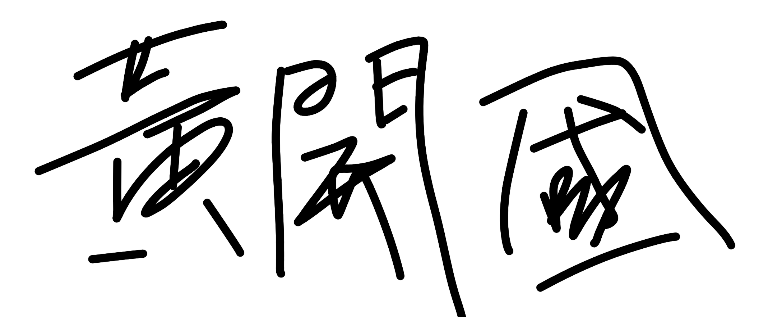

# HKG的博客空间

 
大家好，欢迎来到我的博客空间，邮箱：1991588930@qq.com

> 总有人间一两风，填我十万八千梦
>
> 愿许清风知我意，散我心中意难平

- [x] 我是hkg
- [x] 安徽省滁州市凤阳县

本科毕业于[新疆大学物理科学与技术学院](https://phy.xju.edu.cn/)，毕业论文指导老师：[王淑英老师/教授](https://phy.xju.edu.cn/info/1121/2164.htm)

硕士毕业于BNU物理与天文学院，导师是[安维明老师/教授](https://astro.bnu.edu.cn/zw/gk/szdw/zrjs/js/102182.html)。
在老师指导下，曾获得物中国物理学会[2022年学术会议优秀海报奖](http://meeting.cps-net.org.cn/sustech2022/multiinfo/74)
，发表学术期刊[等离子密度对尾场加速器中最优束流负载的影响](http://www.bnujournal.com/article/doi/10.12202/j.0476-0301.2023166)

[2017年周培源力学竞赛国三](https://publicqn.saikr.com/23ac802d349a4fb6bc7586455d363a341498643688769.xls?attname=%E9%99%84%E4%BB%B62%EF%BC%9A%E4%B8%AA%E4%BA%BA%E8%B5%9B%E4%B8%89%E7%AD%89%E5%A5%96%E5%92%8C%E4%BC%98%E7%A7%80%E5%A5%96.xls)

[大学生数学竞赛新疆赛区一等](https://mp.weixin.qq.com/s/JK12FDrq0Thcwr0rGBTbIA)

 ***
 ---
 

---

## 相对论/光速/时间
1，大质量天体会弯曲周围的时空，为什么我们感觉不到
2，时间是什么？我们的上一秒去哪儿了？

把时间当成四维空间的一个维度就可以理解了

先从低纬度理解，比如在一维空间里，两个人吵架了，女的一直向上走，结果最后又回到了原点。因为他们缺少一个维度，所以他们不知道自己其实走的是一个曲线。这个曲线就是圆形，圆形是二维空间的东西

同样的，两个蚂蚁自认为生活在二维空间中，他们平行向上前进，结果诡异的事情出现了，两个蚂蚁相遇了，因为我们知道平行线是不可能相遇的，但这只满足二维空间，在三维空间中的球体上，两个平行线是可以相交的。但是二维空间的蚂蚁理解不了

## 工程项目积累

- 雾度（haze）是偏离入射光 2.5°角以上的透射光强占总透射光强的百分数，雾度越大意味着薄膜光泽以及透明度尤其成像度下降
- 太阳倒灌的步骤：一度一度的去算，360度/180度，找出哪个特定角度的太阳辐射最大
1.在眼盒处设置一个光源，天窗上/头顶上做一个靶结构，以眼盒为光源看看有没有光，因为光路可逆，可以确定杂光的路径
2.开始模拟真的太阳光，为了要看能量有多少，因为用眼盒做光源是模拟不出来光源的能量
  第一步是找杂光路径，第二步确定能量，如果能量特别小，可以忽略
  阳光倒灌要对元器件进行热分析
-

## 刘珂矣

## Github中Readme的编写规范--我这个博客的编写规则

     换行：两个空格+回车
     多行文本：4个空格
     加横线：三个 ***或---
     

